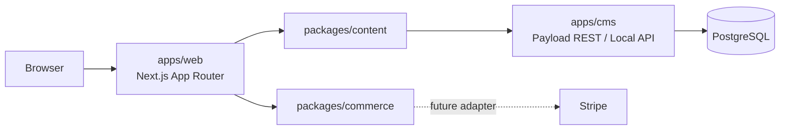

# Terrova architecture

## Intent

Terrova is a multi-brand platform, not a single branded storefront with future tenant fields added later. Brand ownership is explicit in content, plans, editions, boxes and wine records. Hostname-to-brand resolution belongs behind the `ContentRepository` boundary and will be implemented when the frontend begins consuming Payload.

## Runtime surfaces

### `apps/web`

- Next.js App Router with React Server Components by default.
- Homepage content remains server-rendered. Each production scene owns a minimal client motion boundary around its semantic Server Component content.
- GSAP and ScrollTrigger drive scene timelines and desktop pinning.
- Lenis provides smooth scrolling only when reduced motion is not requested.
- Framer Motion is reserved for small UI feedback, not page orchestration.
- Content remains visible and usable without animation; mobile collapses pinned scenes into a linear editorial flow.

### `apps/cms`

- Payload CMS runs as a separate Next.js application on port 3001.
- PostgreSQL uses Payload's official Drizzle-based adapter.
- Development uses schema push. Shared and production environments must use committed migrations.
- Payload authentication protects administrative writes. Public catalogue reads are currently allowed so the web content adapter can be added without widening permissions later.

## Core data decisions

### Brand ownership

`Brands` owns hostnames, currency and theme values. Brand relationships are required on customer-visible aggregate roots. Shared reference data such as countries and grapes remains global.

### Wine is not inventory

`Wines` contains the editorial identity: producer, origin, grapes, vintage and story. `WineSKUs` represents a sellable bottle format with SKU, size and price. Boxes reference `WineSKUs`, never `Wines`, so a 750 ml bottle and a magnum remain distinct commerce items without duplicating the wine narrative.

### Subscription boundaries

`packages/commerce` defines checkout and subscription ports but contains no Stripe SDK and performs no payment calls. Payload stores optional external provider references on plans and SKUs. A future Stripe adapter must translate those domain contracts without leaking Stripe objects into UI or CMS collection types.

The homepage plan presentation is a separate, typed read model. It owns editorial positioning, CTA labels, discovery attributes and numeric `Money`, while omitting bottle counts and Stripe identifiers. A future content adapter will map Payload `Plans` into this read model; a later checkout action may pass the stable plan code into `CommerceGateway`. Rendering a plan never imports Stripe and selecting one performs no payment call.

### Wine Profile boundary

`TasteSignal` is a presentation read model for the homepage narrative only. It can describe a place, grape, style or saved memory together with optional wine context, a coarse sentiment and display weight. The demo records are immutable local content: they are not customer data, ratings or recommendations. A future authenticated Wine Profile may map persisted customer signals into this shape behind a dedicated customer/content adapter, but no persistence, account API or personalization algorithm exists in the homepage runtime.

## Scene system

The homepage is a scene rail, not a generic section grid. All seven production scenes use explicit semantic components and colocated timeline factories on the shared motion runtime. Reduced-motion users receive complete static editorial compositions, and mobile avoids long pinned Process/Origins/Taste sequences. Choose Your Journey is one shared editorial stage with explicit, accessible plan selection—not a reusable pricing-card grid. Final CTA routes both commercial paths to `/boxes`, the current safe pre-checkout boundary; it performs no commerce mutation.

Scene sequence:

1. Discover
2. Unbox
3. Origins
4. Process
5. Choose Your Journey
6. Your Taste
7. Final CTA

## Environment and security

- Never commit real secrets or production database URLs.
- Rotate `PAYLOAD_SECRET` before any shared deployment.
- Keep server-only environment values inside `apps/cms`.
- Validate every future write operation server-side; client affordances are not authorization.
- Webhooks, Stripe checkout and customer authentication are intentionally out of scope for this foundation.

## Quality gates

Every pull request targets `main` through the foundation CI workflow. The required local/CI sequence is formatting, lint, typecheck and production builds, followed by functional smoke tests against the two running applications and PostgreSQL. The smoke suite covers the public route shells, homepage scene contract, Payload admin, collection availability and the protected Users collection.

Generated Next.js declaration files are committed for TypeScript discovery but excluded from Prettier because Next owns and rewrites their formatting during builds.

## Next increments

1. Add hostname-based brand resolution and typed Payload queries.
2. Create and commit the first production migration after the schema stabilises.
3. Add editorial journal collections and preview workflows.
4. Implement customer authentication separately from Payload admin authentication.
5. Implement a Stripe adapter behind `CommerceGateway`, including idempotent webhooks.
