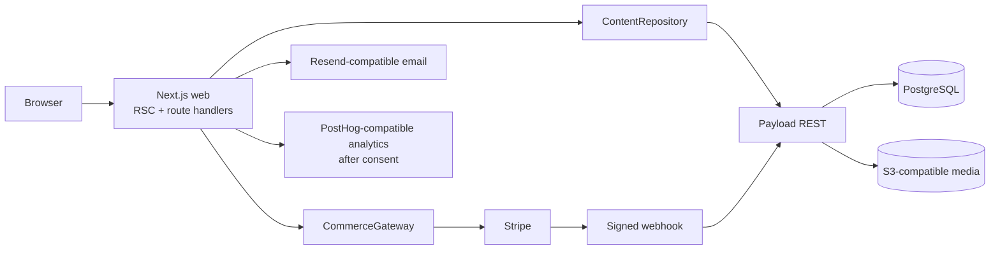

# Terrova architecture

## System intent

Terrova is a multi-brand platform whose first tenant is Terrova. Tenant ownership is explicit on every customer-facing aggregate; shared reference data such as countries and grapes remains global. Hostname resolution occurs behind `ContentRepository`, with a configured default only for previews and local development.

## Runtime boundaries

- `apps/web` owns rendering, customer session cookies and same-origin application actions. Server Components are the default; GSAP/ScrollTrigger/Lenis/Framer Motion stay inside focused client boundaries.
- `apps/cms` owns source-of-truth content and operational records. Administrative `Users` and authenticated `Customers` are deliberately separate.
- `packages/types` owns provider-neutral domain read models.
- `packages/content` owns hostname resolution, CMS repository contracts and explainable taste aggregation.
- `packages/commerce` owns `CommerceGateway`, the Stripe adapter, event translation and a server-only test adapter.

No UI or CMS schema imports Stripe objects. No browser receives CMS service credentials or Stripe secret keys.

## Data invariants

- `Wine` is editorial identity; `WineSKU` is the sellable bottle/format, inventory and provider reference. They must never be merged.
- Boxes reference WineSKUs. Editions provide narrative and eligibility; Boxes provide plan-specific operational packing state.
- Inventory is an append-only movement ledger. A movement updates both on-hand and reserved balances and cannot make either negative or reserve more than is on hand.
- Order state transitions are constrained. Entering `preparing` materializes order items and reserves box stock; `shipped` consumes stock and releases the reservation; `delivered` creates idempotent Cellar entries.
- Ratings can only reference a bottle already in the authenticated customer’s Cellar. Taste signals are deterministic aggregates of observed ratings; they are not AI recommendations.
- Signed provider events are recorded before processing and marked processed, ignored or failed. Provider event IDs and invoice IDs are unique.

See [data model](data-model.md) for collection ownership and lifecycle details.

## Content and publication

Public catalogue, plan, edition, journal, legal and site-setting reads come from Payload. Only `live`, `ready` or `active` records are exposed according to collection semantics. In-memory fixtures are development-only and are structurally impossible in a production build. Homepage art direction remains code-owned to preserve its approved seven-scene choreography; its product plan values are CMS-driven.

Scene sequence is fixed: Discover, Unbox, Origins, Process, Choose Your Journey, Your Taste and Final CTA. Reduced motion keeps the complete narrative but removes pinning/parallax. Mobile uses an editorial linear flow.

## Authentication and authorization

Payload issues customer JWTs; the web stores them in `HttpOnly`, `SameSite=Lax`, production-secure cookies. Account APIs use the customer token, while narrowly scoped server operations use a timing-safe service token. Collection access filters customer-owned rows at the database query boundary. Administrative writes require a Studio user or service identity.

See [auth and security](auth-security.md).

## Commerce and integration decisions

Checkout accepts stable plan codes, resolves the active CMS plan server-side and passes only provider references to `CommerceGateway`. Success pages are not payment truth; signed webhooks are. Billing management uses the provider portal. Promotions are server-resolved. The deterministic test adapter cannot run in production without a second explicit opt-in.

Email and analytics are thin HTTP adapters with safe no-op behavior when unconfigured. Analytics capture occurs only after explicit consent. Media uses Payload’s official S3-compatible adapter when configured and local uploads in development.

## Availability and deployment

Web and CMS expose health endpoints. Containers run as a non-root user. Database changes are committed migrations, executed as a one-off release step before app rollout. Media is externalized; PostgreSQL and object storage require independent backup policies. See [deployment](deployment.md).

## Accepted release-candidate constraints

- The in-process rate limiter is suitable for a single web replica; multi-replica launch requires a shared limiter/WAF rule.
- Gift checkout/redemption stays disabled until duration, recipient activation and refund rules are approved.
- Legal text is structurally publishable but requires qualified review.
- Final photography can replace the approved code-directed temporary art without changing layout contracts.
